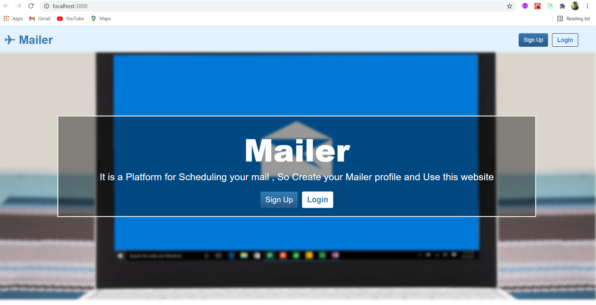
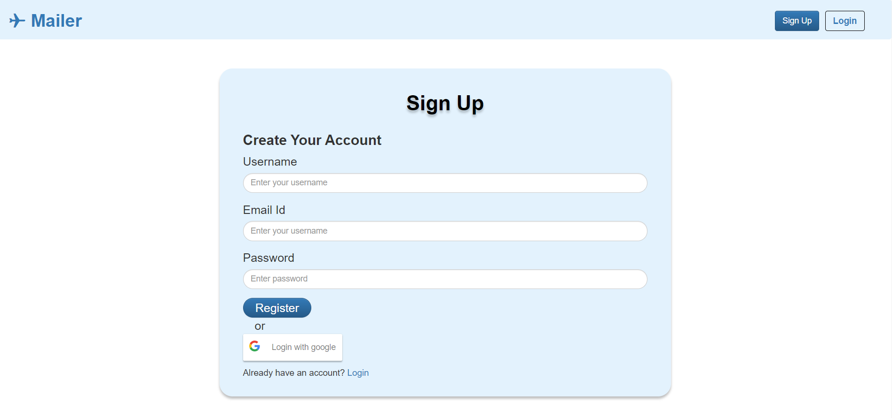
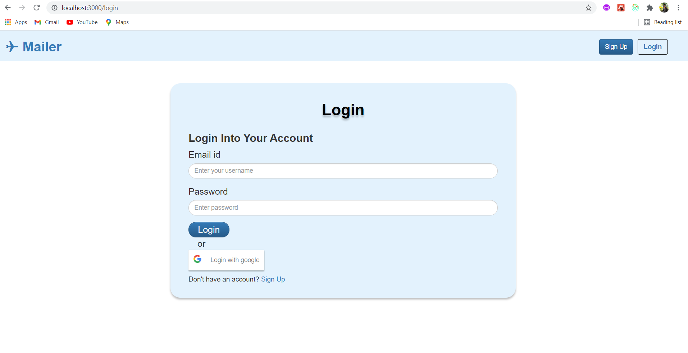
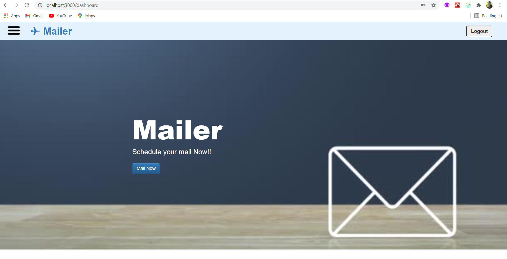
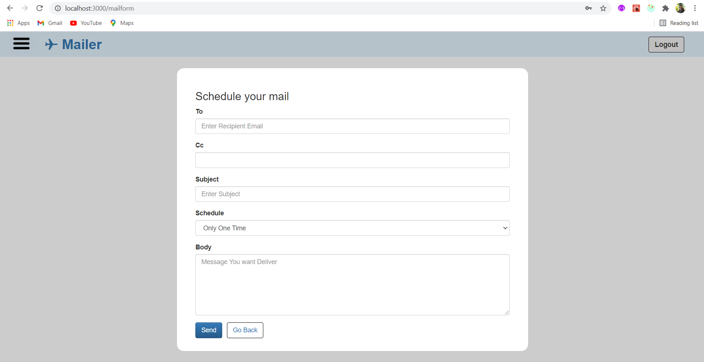
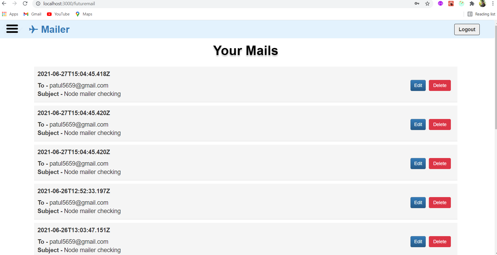
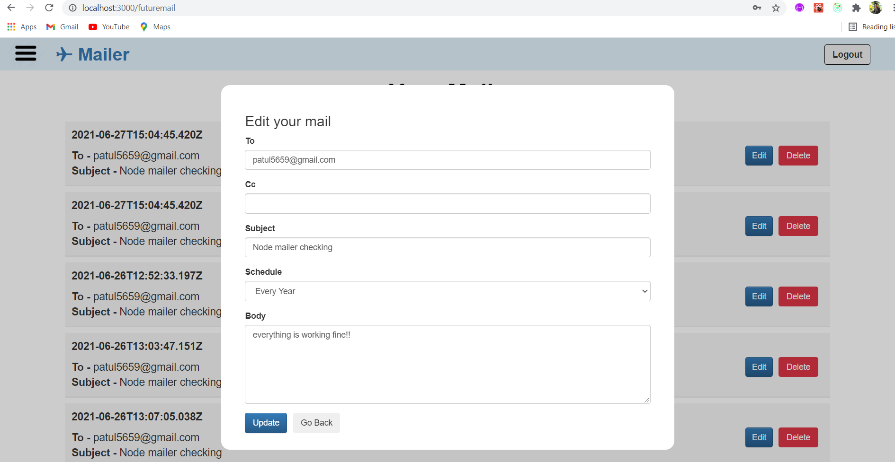
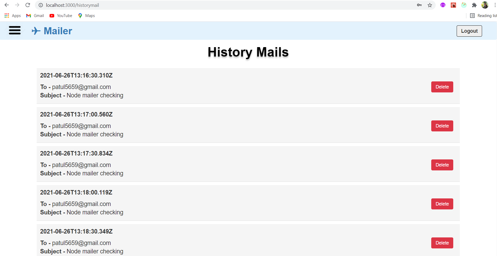
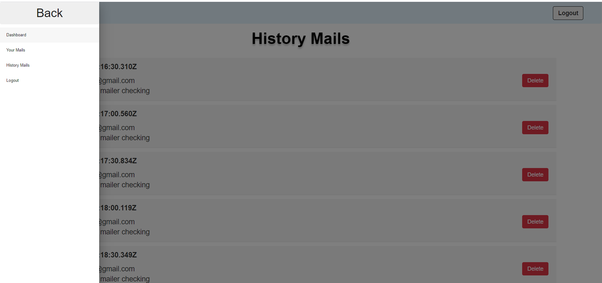

# Flipr_Hackathon
Hackathon By flipkart

So This website is build using MERN Stack , User can register by manually or by google account and after login , they can easily login in and 
User can schedule mail or send mail any time , After mail is send , the user's history mail will be shown to his/her history tab and schedule mail will be shown into yourmails section
also user can delete this mail and edit this mails.

Also This website is Fully Responsive.

Landing Page :-

Sign Up Page :-

Login Page :-

Dashboard Page :-

Send Mail Form :-

Your Mails Page :-

Edit Mails Page :-

History Mails Page :-

Last Page :-

